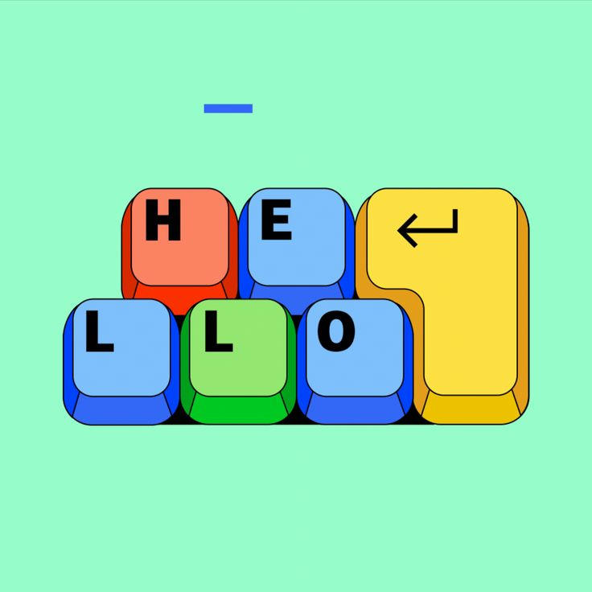

  

  

  

---

# 👾 Hey, I'm John

### 💻 Frontend Developer | ⚡ Vibe Coder | 🎨 Graphic Designer | 💡 Mentor | 🚀 Sales Person

I'm a creative developer who loves turning ideas into **modern, interactive and visually engaging websites**.

I combine **development + design + creativity** to build digital experiences that don't just work — they look good too.

* 🔭 Building creative web projects
* 🌱 Learning and improving every day
* ⚡ Exploring AI & Vibe Coding
* 🎨 Passionate about UI and visual design
* 🚀 Turning concepts into real products
* 💡 Always experimenting with new ideas

 

---

# 🧠 What I Do

 

---

# 🛠️ Tech Stack

### 💻 Languages & Frontend

  

### 🎨 Design

  

### ⚙️ Tools

  

---

# 🚀 Featured Projects

### 🌐 My Portfolio

My personal portfolio showcasing my development, design and creative work.

---

### 👕 Aura Apparel

A modern clothing brand website focused on creative UI and product presentation.

---

### ❌ Tic-Tac-Toe

An interactive game project built with frontend technologies.

---

### 🧮 Customized Calculator

A calculator project created to practice JavaScript logic and UI development.

---

<!-- ===================== ANALYTICS ============================= -->

<h2 align="center">📊 // GITHUB ANALYTICS //</h2>

  <im
    src="https://github-readme-stats.vercel.app/api?username=John-coder92&show_icons=true&count_private=true&include_all_commits=true&hide_border=true&bg_color=050B18&title_color=00E5FF&icon_color=00E5FF&text_color=B8EFFF"
    width="48%"
  />

  <im
    src="https://github-readme-stats.vercel.app/api/top-langs/?username=John-coder92&layout=compact&hide_border=true&bg_color=050B18&title_color=00E5FF&text_color=B8EFFF"
    width="41%"
  />

  

  

<!-- ============================================================= -->
# 🔥 GitHub Streak

  

---

# 🏆 GitHub Trophies

  <im
    src="https://github-readme-stats.vercel.app/api?username=John-coder92&show_icons=true&hide_border=true&hide_title=true&bg_color=050B18&text_color=00E5FF&icon_color=00E5FF&include_all_commits=true"
    width="75%"
  />

 

<table align="center">
<tr>

<td align="center">

<b>⚡ COMMITS</b> 

</td>

<td align="center">

<b>⭐ STARS</b> 

</td>

<td align="center">

<b>📦 REPOSITORIES</b> 

</td>

</tr>
</table>

 

  <b>⚡ SYSTEM STATUS: ACHIEVEMENTS TRACKING ⚡</b>

<!-- ========================================================= -->
# 📈 Contribution Graph

<h2 align="center">⚡ GITHUB ACTIVITY</h2>

  

---

# 🎯 Currently

<!-- ===================== CURRENTLY ===================== -->

  

<table align="center">
<tr>
<td align="center" width="250">

### 💻 Building

Modern & interactive websites  
Creative frontend experiences

</td>

<td align="center" width="250">

### 🧠 Learning

Advanced JavaScript  
GSAP • Three.js • WebGL

</td>

<td align="center" width="250">

### 🚀 Exploring

AI-powered development  
New web technologies

</td>
</tr>
</table>

  ⚡ ALWAYS LEARNING • ALWAYS BUILDING ⚡

<!-- ====================================================== -->

# 🌐 Let's Connect

---

# 💭 Developer Mindset

### <i>"I believe development is more than just writing code — it’s about turning ideas into meaningful digital experiences. I focus on learning continuously, thinking creatively, solving problems efficiently, and building things that are both functional and visually impactful. Every project is an opportunity to experiment, improve, and push my skills further."</i>

  

---

  <b>Thanks for visiting my profile! 👾</b>

